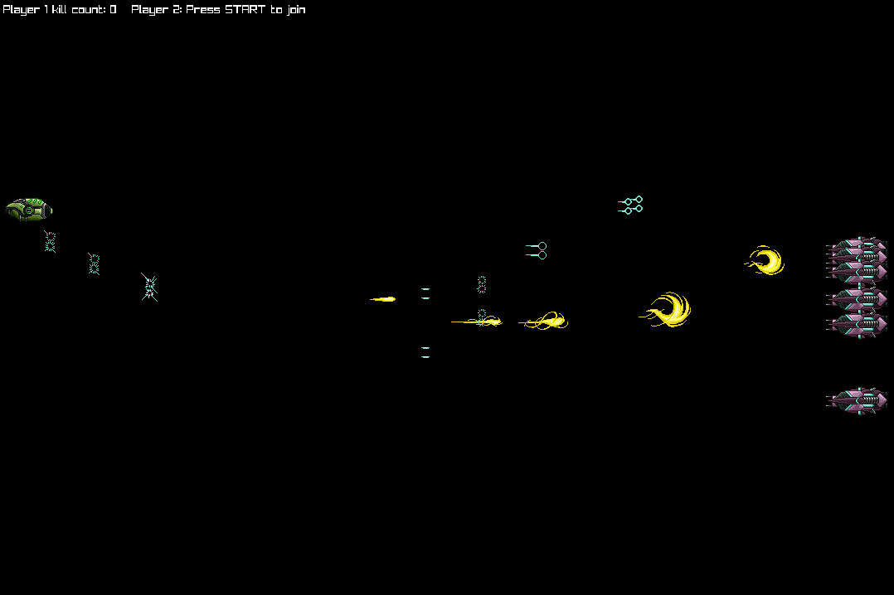

# Space War

A space shooter game where you pilot a spaceship against CPU-controlled enemy ships.
Built in C as a way to explore game development closer to the metal.



## Description

Space War is a 2D space combat game built with [raylib](https://www.raylib.com/) and C23.
The player controls a spaceship, navigating the screen and firing bullets while
staying within the battlefield. CPU-controlled enemy ships with state-based AI
pursue the player and fire back. Each enemy takes two hits to destroy, and new
enemies spawn when all are eliminated. Supports up to two players.

Built entirely in C without a game engine, the project focuses on understanding game
loop fundamentals, frame-independent movement, and manual resource management through
a simple, modular codebase.

### Features

- Local multi-player support (up to 2 players)
- Two distinct player ship types (Viper and Raptor)
- Keyboard and gamepad support (plug-and-play, auto-detected)
- CPU-controlled enemy ships with state-based AI (pursuit and retreat behaviors)
- Enemy ships shoot at the player when in attack range
- Player bullets damage enemies (two hits to destroy)
- Enemy bullets destroy the player on hit
- Enemies respawn when all are eliminated
- Kill count tracked per player and displayed in HUD
- Boundary collision for players, enemies, and bullets
- Frame-independent movement using delta time
- Texture-based sprites for ships and bullets

## Build

### Dependencies

- [raylib](https://www.raylib.com/) (tested with raylib 6.x)
- GCC (or any C23-compatible compiler)
- [just](https://github.com/casey/just) (command runner)

### Compiling and running

```sh
just build
just run
```

## License

Space War is open-sourced software licensed under the [MIT license](LICENSE).
